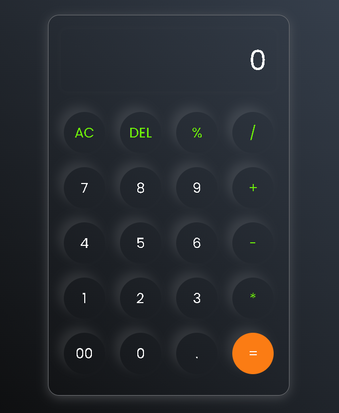

# Modern Calculator using HTML, CSS, and JavaScript
A stylish and resposive calculator made using basic web technologies - HTML, CSS and JavaScript. This calculator supports all basic arithmetic operations with a sleek and smooth interactions.

## Features
Perform basic operations: +, -, /, *, %. 
Real-time result display
Smart operator handling (prevents invalid sequences like '++', '**').
'AC' button clears the screen.
'DEL' removes the last character.
Responsive design for all screen sizes.
Modern dark UI with transparent and glowing effects.

## Screenshot
[click here to check](https://jeevan400.github.io/Calculator/)

## Tech Stack
HTML for Structure and layout.
CSS for Styling.
JavaScript for Functional logic and interactivity.